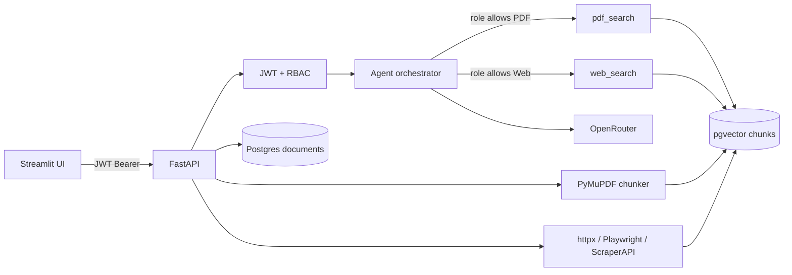

# Secure Multi-Source QA Agent

Conversational agent that answers questions from **uploaded PDFs** and **scraped websites**, with **JWT authentication** and **role-based tool access**.

This matches the take-home: *Design and Implement an Agentic System for Secure Multi-Source Question Answering*.

## What was implemented

| Requirement | Status |
|---|---|
| JWT login + role claim | Done |
| RBAC matrix (Manager / Assistant Manager / Developer) | Done, enforced in 3 layers |
| PDF ingest, chunk, pgvector index, page citations | Done (end-to-end) |
| Website ingest with UA rotation + Playwright + optional ScraperAPI | Done |
| LangChain tools + agent orchestration | Done |
| Dynamic add/remove of PDFs and URLs (no code change) | Done |
| Streamlit UI: role dropdown, JWT, chat, citations | Done (bonus) |
| Open-source embeddings + OpenRouter LLM | Done |
| Postgres (app data) + pgvector (vectors) via Docker | Done |

You are not required to use a paid model. Without an API key the system still indexes, retrieves, and returns **extractive answers with citations**.

## Architecture



### Why isolate PDF and web rows?

Chunks are stored in one pgvector table but **always filtered by `source_type`**. A Developer query never searches `source_type = pdf`, so handbook pages cannot leak.

RBAC is also checked at:

1. **API** – upload/list/delete routes use `require_pdf_access` / `require_web_access`
2. **Agent** – only allowed LangChain tools are eligible for that JWT role
3. **Index** – pgvector queries are constrained to `source_type` for that tool

### Role matrix

| Role | PDF | Web |
|---|---|---|
| Manager | yes | yes |
| Assistant Manager | yes | no |
| Developer | no | yes |

Changing the dropdown issues a **new JWT**. The previous token is not mutated; the UI simply stops sending it.

## Dynamic uploads (no code change)

- `POST /documents` saves the file under `data/pdfs/{id}_{safe_name}.pdf`, chunks **per page**, writes vectors into **pgvector**, and inserts metadata into **Postgres**.
- `POST /websites` validates the URL (SSRF guard), scrapes, caches text in `data/web_cache/`, indexes into pgvector, and inserts a Postgres row.
- `DELETE` removes the file/cache, deletes matching pgvector rows, and deletes the Postgres catalog row.

The agent never hard-codes document names. Anything in the registry is searchable on the next query.

## Scraping strategy

1. Optional **ScraperAPI** if `SCRAPERAPI_KEY` is set (JS render on).
2. **httpx** with rotating desktop User-Agents.
3. **Playwright Chromium** when the response looks like a Cloudflare / JS challenge.

Private/loopback URLs are rejected before any request is made.

## LLM trade-offs

- **Embeddings:** `sentence-transformers/all-MiniLM-L6-v2` (open source, 384-d, CPU).
- **App DB + Vector DB:** one Docker Postgres (`pgvector/pgvector:pg16`) with two databases: `rag_app` (catalog) and `rag_vectors` (embeddings).
- **Generator:** OpenRouter (`openai/gpt-4o-mini` by default). Falls back to extractive citations if the key is missing.
- **Agent loop:** a constrained router + retrieve + synthesize. Tools are LangChain `@tool` objects.
- **500-page PDFs:** page-level extract with PyMuPDF then recursive chunking. Ingest is synchronous for the demo.

## Run locally

Python 3.11–3.13.

Docker Desktop must be running. `python run.py` starts both databases, then the API and UI.

```bash
cd C:\Users\praka\Downloads\rag
python -m venv .venv
.venv\Scripts\activate
pip install -r requirements.txt
copy .env.example .env
python scripts\generate_sample_pdf.py
python run.py
```

- API docs: http://127.0.0.1:8000/docs
- UI: http://127.0.0.1:8501
- Docker Postgres: `127.0.0.1:5433`
  - `rag_app` — document/website catalog
  - `rag_vectors` — chunk embeddings (pgvector)

Put `OPENROUTER_API_KEY` in `.env`. Change `OPENROUTER_MODEL` if you want a different OpenRouter model.

## Deploy on Railway

Railway needs **three pieces**: Postgres with **pgvector**, the FastAPI API, and the Streamlit UI. The default Railway Postgres plugin does **not** include pgvector — use their pgvector template.

1. Push this folder to a GitHub repo (do not commit `.env`).
2. In [Railway](https://railway.com), create a project.
3. Add **Postgres with pgvector**: [template](https://railway.com/deploy/postgres-with-pgvector-engine).
4. **New → GitHub Repo** → this repo. That service is the **API**.
   - Start command is already `python scripts/start_api.py`.
   - Generate a public domain under **Settings → Networking**.
   - Memory: **2 GB** (MiniLM embeddings load into RAM).
5. **New → GitHub Repo** → the **same** repo again. This service is the **UI**.
   - Override the start command: `python scripts/start_ui.py`
   - Health check path: `/_stcore/health`
   - Generate a public domain.
6. On the **API** service, add a volume mounted at `/data` so uploaded PDFs survive restarts.

### Variables

**API service**

| Variable | Value |
|---|---|
| `DATABASE_URL` | `${{Postgres.DATABASE_URL}}` (use the pgvector service name if it differs) — private URL |
| `JWT_SECRET` | a long random string |
| `LLM_PROVIDER` | `openrouter` |
| `OPENROUTER_API_KEY` | your key |
| `OPENROUTER_MODEL` | `openai/gpt-4o-mini` |
| `OPENROUTER_SITE_URL` | the Streamlit public URL, e.g. `https://ui-production-xxxx.up.railway.app` |
| `DATA_DIR` | `/data` |

**UI service**

| Variable | Value |
|---|---|
| `API_URL` | the API public URL, e.g. `https://api-production-xxxx.up.railway.app` |

Do not copy local `POSTGRES_HOST=127.0.0.1` values into Railway. `DATABASE_URL` is enough; catalog tables and vectors share that one database.

After the first deploy, open the **UI** domain, pick a role, and sign in. Confirm `GET /health` on the API domain returns `"status": "ok"`.

### Demo script

1. Sign in as **Manager**. Upload `data/pdfs/sample_acme_handbook.pdf`. Add `https://example.com`.
2. Ask: *How many remote days does ACME allow?* → expect a **page citation**.
3. Switch to **Assistant Manager**, issue a new JWT, ask about the website → PDF answers only; web routes return 403.
4. Switch to **Developer**, ask about the handbook → the PDF tool is not attached; no handbook text is retrieved.

```bash
pytest -q
```

## Project layout

```
app/
  auth/           JWT, RBAC, FastAPI dependencies
  api/            login, documents, websites, query
  agent/          OpenRouter LLM, LangChain tools, orchestrator
  db/             Postgres + pgvector pools
  retrieval/      PDF/web ingest, pgvector search, Postgres catalog
  security.py     filename / query / SSRF sanitization
docker-compose.yml
frontend/app.py   Streamlit console
scripts/          sample PDF generator
tests/            RBAC and sanitization
```

## API sketch

- `POST /auth/login` `{username, role}` → JWT
- `POST /documents` multipart PDF (PDF roles)
- `POST /websites` `{url}` (web roles)
- `POST /query` `{question}` → answer + citations + tools used
- `GET /health`
